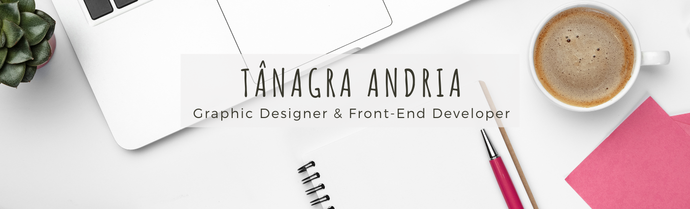

<h3>Olá,
tudo bem?</h3>
<h4>Me chamo a Tânagra, mas pode me chamar de Tân.   
 Sou desenvolvedora front-end, estou cursando o segundo ano de Gestão de TI, e tenho formação em  Design Gráfico. </h4>
 
<h4>Linguagens e softwares:</h4>  

 
 <a href="https://www.w3schools.com/css/" target="_blank">  
  
  </a> 
   
 
 
   <a href="https://www.adobe.com/in/products/illustrator.html" target="_blank">  

<h4 align="left">Curiosidade:</h4>

* 
 Me formei em 2011 em Teatro, e trabalhei como atriz por 10 anos, em paralelo também trabalhei com Design gráfico. Essas experiências me trouxeram uma bagagem variada  no qual eu destaco a criatividade, trabalho em equipe e a comunicação.

* 
 Iniciei meus estudos de programação Front-End no bootcamp da Laboratória. O bootcamp  tem duração de 6 meses com foco em empregabilidade de mulheres na área de programação. No bootcamp são desenvolvidas não só as habilidades técnicas, como também as habilidades socioemocionais e profissionais, como autoaprendizagem, comunicação, e trabalho em equipe.
()

<h4 align="left">Meus contatos:</h4>

  

