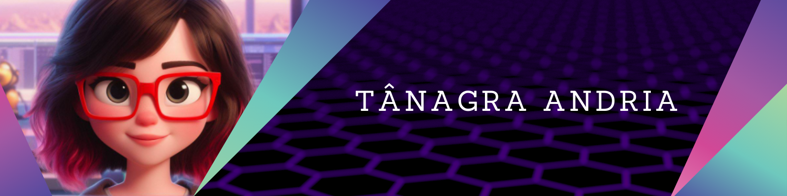

  

  
🎓 **Formada em Gestão da Tecnologia da Informação**  
💻 **Desenvolvedora Front-End**  
🚀 **Apaixonada por criar experiências web intuitivas e eficientes**

## 🛠 Tecnologias e Ferramentas

- **Linguagens:**  
  
  

- **Frameworks e Bibliotecas:**  
  
  

- **Ferramentas de Desenvolvimento e DevOps:**  
  
  
  
  
  
  
  
  
  

- **Sistemas Operacionais:**  
  
  

- **UI/UX:**  
  
  

## 📈 Experiência

- Desenvolvo interfaces web responsivas e acessíveis utilizando **Angular**, focando na melhor experiência do usuário.
- Integro e gerencio pipelines de CI/CD eficientes através do **Jenkins**, garantindo entregas contínuas e de alta qualidade.
- Realizo gerenciamento e acompanhamento de projetos e evidências utilizando o **Octane**, assegurando a rastreabilidade e eficiência dos processos.
- Colaboro em equipes multidisciplinares aplicando metodologias **Ágeis**, promovendo comunicação eficaz e entregas iterativas.

## 🌱 Atualmente Aprendendo

- **Docker** para containerização e otimização de ambientes de desenvolvimento e produção.
- **Testes Automatizados** com **Jest** para garantir a qualidade do código.
- **AWS** para ampliar o conhecimento em infraestrutura na nuvem.

## 🎯 Objetivos

- Contribuir para projetos que impactem positivamente a vida das pessoas através da tecnologia.
- Continuar aprimorando habilidades técnicas e de gestão para liderar equipes e projetos de desenvolvimento.
- Participar de comunidades e eventos de tecnologia para compartilhar conhecimento e aprender com outros profissionais.

## 📫 Entre em Contato

## 💡 Curiosidades

- Além de tecnologia, sou apaixonada por **arte** e **design**, o que me ajuda a criar interfaces mais criativas e intuitivas.
- No meu tempo livre, gosto de explorar novas **tecnologias** e **frameworks**.

**"A tecnologia é melhor quando reúne as pessoas."** – Matt Mullenweg

Obrigado por visitar meu perfil!! ✨
